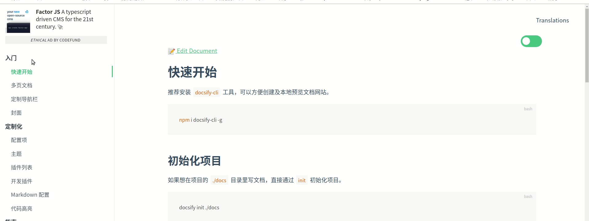

# Docsify 学习笔记

> **[官网中文手册](https://docsify.js.org/#zh-cn/)**

## 案例
> **https://docsify.js.org/#/zh-cn/awesome?id=showcase**
* https://Xiechengqi.github.io/DocsifyNotes
* https://Xiechengqi.github.io/AwesomeMacFork
* https://dunwu.github.io/frontend-tutorial
* https://docsify.js.org
* https://ripperhe.com/awesome-mac-html/#/
* https://jalan.space/leetcode-notebook

## 命令

``` shell
# 安装
npm i docsify-cli -g
# 初始化
docsify init [项目路径]
# 启动
docsify serve [项目路径]
# 或
python3 -m http.server
```

## 侧边栏

### 效果1
**[在线预览](https://Xiechengqi.github.io/DocsifyNotes/sidebardemo1)** - **[源码](https://github.com/Xiechengqi/DocsifyNotes/sidebardemo1/)**


